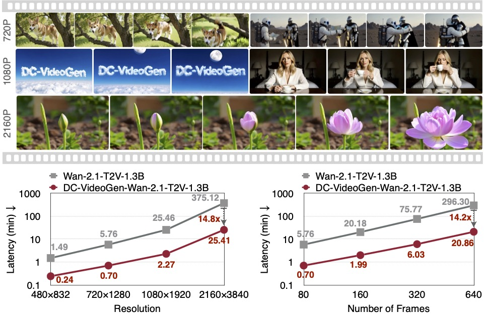
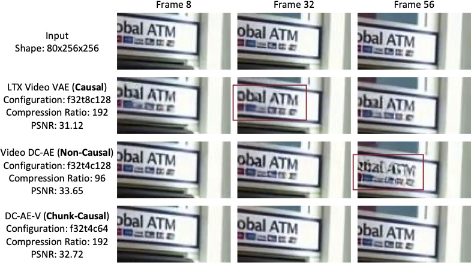
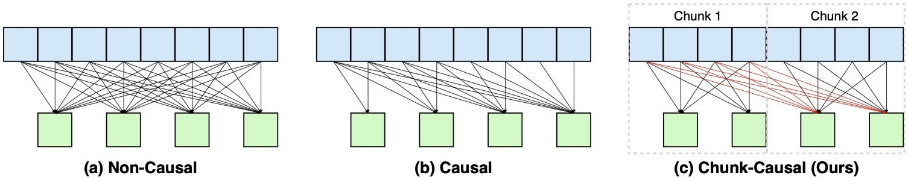
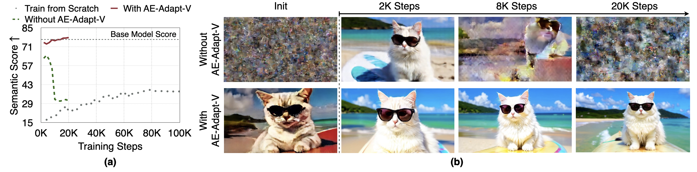
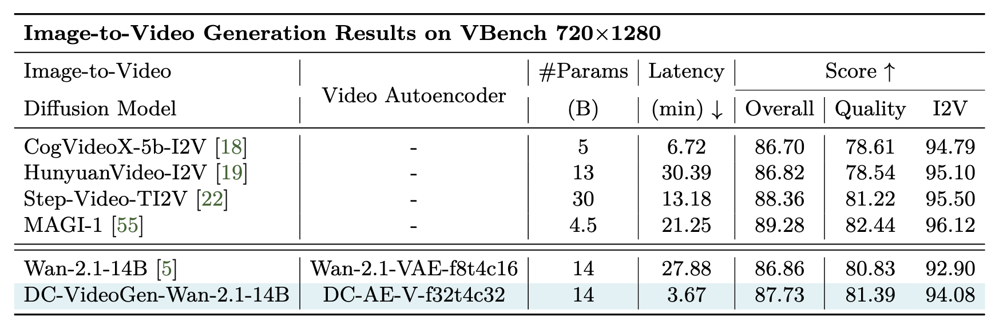
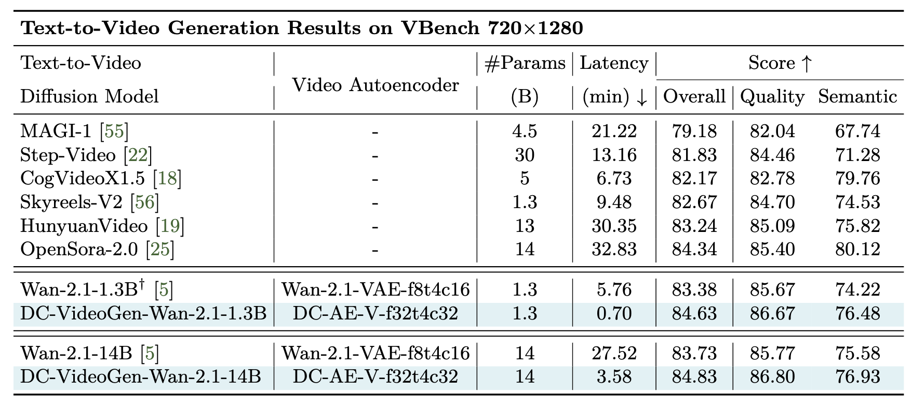

# DC-VideoGen: Efficient Video Generation with Deep Compression Video Autoencoder

<div align="center">
  <a href="https://hanlab.mit.edu/projects/dc-videogen/"></a> &ensp;
  <a href="https://arxiv.org/abs/2509.25182"></a> &ensp;
  <!-- <a href="https://huggingface.co/collections/dc-ai/dc-videogen-68db2bbd81323b0800d0e811"></a> &ensp; -->
  <a href="https://hanlab.mit.edu/projects/dc-videogen/"></a> &ensp;
</div>

<p align="center" border-radius="10px">
  
</p>

## 🔥🔥 News
- (🔥 New) \[2025/9/30\] We released the [DC-VideoGen technical report](https://arxiv.org/abs/2509.25182) on arXiv.

## 💡 Introduction
DC-VideoGen is a new post-training framework for accelerating video diffusion models. Key features:
- 🎬 Supports video generation up to 2160×3840 resolution on a single H100 GPU
- ⚡ Delivers 14.8× faster inference than the base model
- 💰 230× lower training cost compared to training from scratch (only 10 H100 GPU days for Wan-2.1-14B)

DC-VideoGen is built on two core innovations:
- **Deep Compression Video Autoencoder (DC-AE-V)**: a new family of deep compression autoencoders for video data, providing 32×/64× spatial and 4× temporal compression.
- **AE-Adapt-V**: a robust adaptation strategy that enables rapid and stable transfer of pre-trained video diffusion models to DC-AE-V.

### Highlight 1: DC-AE-V - Deep Compression Video Autoencoder with Chunk-Causal Temporal Modeling
- <ins>Under deep compression settings, causal video autoencoders suffer from low reconstruction quality. In contrast, non-causal video autoencoders achieve better reconstruction quality but generalize poorly to longer videos.</ins>
<figure>
  
</figure>

- <ins>DC-AE-V introduces a new temporal modeling design, chunk-causal, to overcome the limitations of non-causal and causal video autoencoders. It preserves causal information flow across chunks while enabling bidirectional flow within each chunk.</ins>
<figure>
  
</figure>

### Highlight 2: AE-Adapt-V - Post-Training Video Autoencoder Adaptation
- <ins>Direct fine-tuning without AE-Adapt-V leads to training instability and suboptimal quality. In contrast, AE-Adapt-V provides a robust initialization that preserves semantics in the new latent space for the video diffusion model, enabling rapid recovery of visual quality and allowing the model to match the base model’s performance with lightweight fine-tuning.</ins>
<figure>
  
</figure>

### Results
<figure>
  
</figure>

<figure>
  
</figure>

## Content
- The code and pretrained models will be released after the legal review is completed.

## Contact

[Han Cai](http://hancai.ai/)

## Related Projects
- [DC-Gen: Post-Training Diffusion Acceleration with Deeply Compressed Latent Space](https://github.com/dc-ai-projects/DC-Gen)

## Reference
```bibtex
@article{chen2025dc,
  title={DC-VideoGen: Efficient Video Generation with Deep Compression Video Autoencoder},
  author={Chen, Junyu and He, Wenkun and Gu, Yuchao and Zhao, Yuyang and Yu, Jincheng and Chen, Junsong and Zou, Dongyun and Lin, Yujun and Zhang, Zhekai and Li, Muyang and others},
  journal={arXiv preprint arXiv:2509.25182},
  year={2025}
}
```
